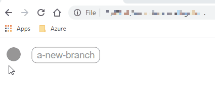
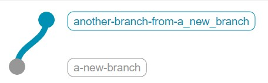
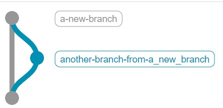
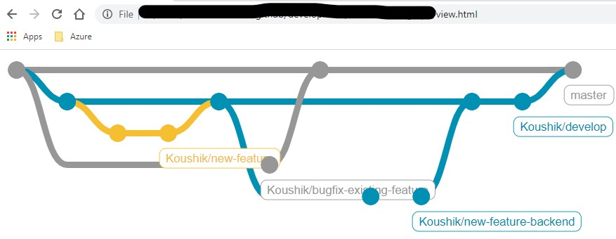

<!-- Post Content -->

## What and Why ?? 
For one of the presentation that I was preparing I planned to show the development standards followed and the GIT strategy for the team. I could have created a repo and then make branches and do all kinds of GIT actions. Later when I push the changes to GitHub or Azure DevOps there I can find the git flow of branches commits tags etc. That is one way why not, take that image and stick it in a presentation or demo !!. But during a decision-design making process adding removing cleaning actions will knock it off the table, that will not work out that _during_ a session and making new changes.

## What the tools already available

### Mermaid diagrams

If you have not already played around with mermaids then there it is... [Mermaid info](https://mermaid-js.github.io/mermaid/#/).

Now I can use Azure DevOps and create mermaids in [WIKI](https://docs.microsoft.com/en-us/azure/devops/project/wiki/wiki-markdown-guidance?view=azure-devops) 

That does not support GIT mermaid unfortunately.

### Using Script library

Since it should be generatable as a view, I choose to investigate if there were any HTML components or Python libraries and found out GitGraph fits best for my need. 

Here are the steps:

1. Install required platform: 
    _[NodeJS](https://nodejs.org/en/download/)_ (Check if ```node``` and ```npm``` are accessible from terminal)

1. From terminal, download GitGraph into project folder - using this library we will create custom views in generating git graph
    ```npm install @gitgraph/js```

1. Create HTML page and import module

    ```
    <!DOCTYPE html>
        <html>

        <head>
            <script src="./node_modules/@gitgraph/js/lib/gitgraph.umd.js"></script>
        </head>
    </html>
    ```

1. Add html body with content division so called ```<div>``` tag after ```<head>```
    ```
      <body>  
        <div id="my-git-graph"></div>
      </body>
    ```

1. Within the html ```<body>``` tag, create script that will fill the div container ```my-git-graph``` that is created in previous step
    ```
    <script>
        // Get the graph container HTML element.
        const graphContainer = document.getElementById("my-git-graph");
    </script>
    ```

1. Now, within the ```<script>``` tag, start using the GitGraphJS module by first initializing with required options
    ```
        const gitgraphOptions = {
            author: "Koushik Aravalli <koushik.aravalli@gmail.com>", // User your email 
            orientation: "vertical", // other options: horizontal, vertical-reverse
            mode: "compact" // initail view hides commit messages (visible when hovering over)
        }

        // Instantiate the graph.
        const gitgraph = GitgraphJS.createGitgraph(graphContainer, gitgraphOptions);
    ```

1. Ready to start with GIT actions within the ```<script>``` tag

    1. Create branch 
    
        ``` 
        const a_new_branch = gitgraph.branch("a-new-branch");
        ```
    
    1. Commit branch with message
    
        ```
        a_new_branch.commit("Initial commit");
        ```
    
    1. Also, add a tag a commit

        ```
        a_new_branch.commit("Initial commit").tag("v0.1-alpha");
        ```
    
    Here is the first branch

    

1. Now, we have a first branch, branch out from there with
    
    ```
    a_new_branch.branch("another-branch-from-a_new_branch").commit("another branch first commit");
    ```

    
    
1. Finally, merge the ```another-branch-from-a_new_branch``` into ```a_new_branch```

    ```
    // One-line
    a_new_branch.merge(a_new_branch.branch("another-branch-from-a_new_branch").commit("another branch first commit"));

    // Split it
    const another_new_branch = a_new_branch.branch("another-branch-from-a_new_branch").commit("another branch first commit");
    a_new_branch.merge(another_new_branch);
    ```

    

With more customizations it can be more illustrated 



That is it.. I dint expect it would be this simple.. and here is the **_[sample-gitgraph-code](https://github.com/koushik-aravalli/development/tree/master/LetsCreateGitgraph)_**