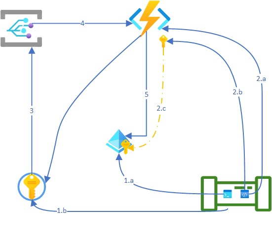

<!-- Post Content -->

This post provides a solution to create new credentails for an App registed in Azure AD. 

## Background

When working with Azure, almost/always `Enterprise applications` and `App registrations` (Service Principal) are setup to use AzureAD as secure identiy provider across services. The registered apps are used by external applications, e.g., github/gitlab/airflow outside Azure, to leverage Azure AD as Identity Provider. A Registered App requires either a Certificate or a Secret (generated and manage by Azure Platform) which are then used within the External app for secure communication. To learn more about Azure Registed App and Enterprise Applications, refer to [Applications and Service Principal Objects](https://learn.microsoft.com/en-us/azure/active-directory/develop/app-objects-and-service-principals)

## Challenge:

A challenge with the credentials is, they are valid within a predefined time frame. This is a default embeded security across organizations as well. So the challenge is to rotate the credentials before they reach the expiration date and thereby update dependent services accordingly. Most of the time, this is a manual effort and the credential handover often happens through insecure channels thereby increasing the overall residual risk.

## Solution Design

To solve the above challenge, one of the solutions is using Azure Native services to identify the change event and execute a Function to perform the rotation. 

The solution uses following Azure resources:

- Azure Active Directory: The registered Application and EnterpriseApplication are managed here
- Azure Keyvault: for Secret management
- Azure Event Grid: for change events across other Azure Services - Help in orchestration Pub-Sub pattern implementation
- Azure Function: Serverless component - Various triggering options

Here is the Solution design:



Following sections, explains the stepwise approach on implementing the proposed architecture. 

## First time action: Create New RegisteredApp and Service Principal

### Create new App in Azure AD

Using PowerShell, create a Registered App in Azure AD:

```
$myApp = New-AzureADApplication -DisplayName "CustomerApp" -Homepage "http://localhost:1234" -ReplyUrls @("http://localhost:1234")

```

### Create Service Principal for existing App

Based on the above created Registerdapp (global), create a local instance Enterprise Application.

```
$spn=New-AzADServicePrincipal -ApplicationId $myApp.AppId
```

### Create Credential Secret for the App 

On the newly created App, Add new credentials with - 

The secret created on the portal appears one for the owner

### Configure Owners on App

On the Registered App, add function app SPN as one of the Owners.

### Configure API Permission on App

The FunctionApp MSI should be given Application permission to perform AD action. `Application.ReadWriteAll`. This can be achieved using PowerShell, cannot be done from the portal

```
$graphApp = Get-AzureADServicePrincipal -Filter "AppId eq '00000003-0000-0000-c000-000000000000'"

$graphapiapprole=$graphApp.AppRoles | Where-Object -FilterScript {$_.Value -match 'Application.ReadWrite.OwnedBy'}

$msi = Get-AzureADServicePrincipal -ObjectId '<Managed Identity of the FunctionApp>'

New-AzureADServiceAppRoleAssignment -Id $graphapiapprole.Id -ObjectId $msi.ObjectId -PrincipalId $msi.ObjectId -ResourceId $graphApp.ObjectId

```

### Add Secret to the Keyvault

In Azure keyvault, Secrets, Add the new secret along with the following:

- Expiration date
- Tags:
    - AppId – ApplicationId of the registered App
    - ObjectId – Object Id of the registered App
    - CredentialVersion – SecretId of the App (can be found on - the Certificates&Secrets)
    - ValidityPeriodDays – number of days from generation till expiry

On the KeyVault Access Policies, include the FunctionApp MSI with Secrets - Get, List, Create, Update, Delete

Create Azure Function with:
- PowerShell on Windows
- Consumption Plan
- MSI enabled
- Access Restrictions Enabled - Include EventGrid Service Tag

### Deploy Event Grid

Create EventGrid with system topic on the Keyvault, such that the events from the key vault can be subscribed to by the Azure Function.

Select Event Filter with "Secret Nearing Expiry" and "Secret Expiry". These are default Azure Event Grid events so no custom events are required at this point.


## Delete expired credentials

As the credentials expire on the Service Principal, the older versions should be deleted. To maintain full control of the deletion, a new HTTP Triggered based Function is created under the Azure Function. 

From Azure Active Directory → Applications, Search for the Application by name. On the `Credentials and Secrets`, copy Secret ID which are planned for deletion. 
In Azure Active Directory → Enterprise Applications, Search for the Service principal linked to the Registered Application. (see picture below)

With the above information build the POST message body with the versions to delete: API end point: http://locahost/api/spn-credential-cleanup.- --> Host it on the same FunctionApp

```
{
    "name": "spn_app_password",
    "objectId": "12345678-cas123-aat2-2344-asdfsad3435f4",
    "appId": "9872134-123d4-7ad2-7890-sdfaserewd345",
    "SecretVersion":[
        "xxxxxxx-xxxx-cccc-aaaa-wer3ve4453g"
    ]
}
```