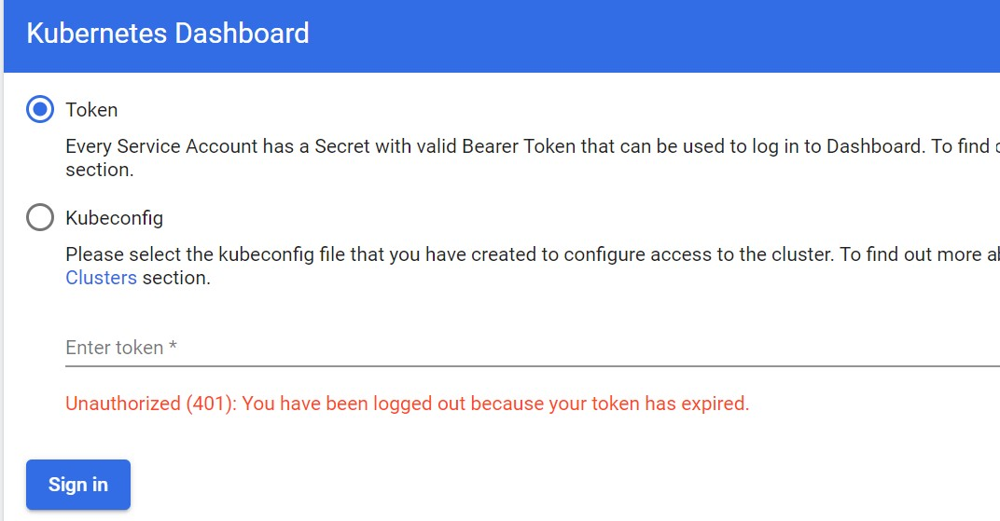
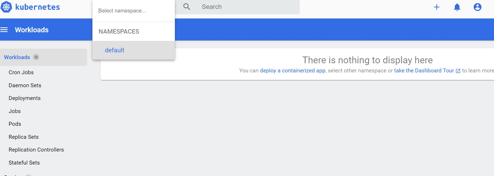

<!-- Post Content -->

Local development of k8s using Docker Desktop is often what I do before deploying services on the Cloud platform. Last month, auto upgrade of the local version to k8s caused unexpected behaviour of the service accounts. Bumping into [Github Ref](https://github.com/kubernetes/kubernetes/issues/110113) made it clear. 

Kubernetes dashboard is one of them which is accessed using SA token. Starting v1.24 version no tokens are provided on service account creation, which improves security of the access and restricting adhoc usage. 

So the basic steps to get the dashboard locally up and running:

### Install Prerequisites 

- Install [Docker Desktop](https://www.docker.com/products/docker-desktop/) with Kubernetes - no additinal installation required for [kubectl](https://kubernetes.io/docs/tasks/tools/install-kubectl-windows/)
- Install [Windows Subsystem for Linux (wsl)](https://docs.microsoft.com/en-us/windows/wsl/install)
- (optional) [Windows Terminal](https://docs.microsoft.com/en-us/windows/terminal/install)
- (optional) [Ubuntu Terminal](https://ubuntu.com/tutorials/install-ubuntu-on-wsl2-on-windows-10#1-overview)

### Deploy Kubernetes Dashboard

k8s provide default dashboard to monitor the resources within the cluster, deployed using the [recommended manifest(s)](https://raw.githubusercontent.com/kubernetes/dashboard/v2.5.0/aio/deploy/recommended.yaml)

Notice that all the objects are within the namespace `kubernetes-dashboard` unlike `kube-system`. Upon deploying the manifest on the cluster `kubectl apply <manifest-url>`, dashboard is almost ready for access. The dashboard is now exposed on port 443 within the cluster which needs to be mapped to localhost port. 

Using `kubectl proxy`, exposes the Cluster API server on port 8001. Try validating the version

```
> curl http://localhost:8001/api

{
  "kind": "APIVersions",
  "versions": [
    "v1"
  ],
  "serverAddressByClientCIDRs": [
    {
      "clientCIDR": "0.0.0.0/0",
      "serverAddress": "192.168.65.4:6443"
    }
  ]
}
```

### Accessing the Dashboard

The dashboard can be accessed using the url 

```
http://localhost:8001/api/v1/namespaces/kubernetes-dashboard/services/https:kubernetes-dashboard:/proxy/#/login
```



To securely accessf it, use the service account `` that is created during the dashboard deployment.

```
> kubectl get sa -n kubernetes-dashboard
NAME                   SECRETS   AGE
default                0         27h
kubernetes-dashboard   0         27h
```

Before v1.24,, all service accounts were created with a token that is saved within the secrets. That way copying the token made it easier to login into the dashboard. But now there is no longer an auto-generated **static** token. 

Therefore, request a new token for the service account which is valid for 60 mins (default). 

```
kubectl create token kubernetes-dashboard -n kubernetes-dashboard
```

In the portal, select option as `Token` and paste the token to login.



Thats should be it to access the portal. During the deployment of the Dashboard in the manifest the, the role binding for the `kubernetes-dashboard` are scoped within the namespace. This is the reason the notification errors pop out on accessing the default namespace objects. Good practice is to create a new service account with required scope access.
